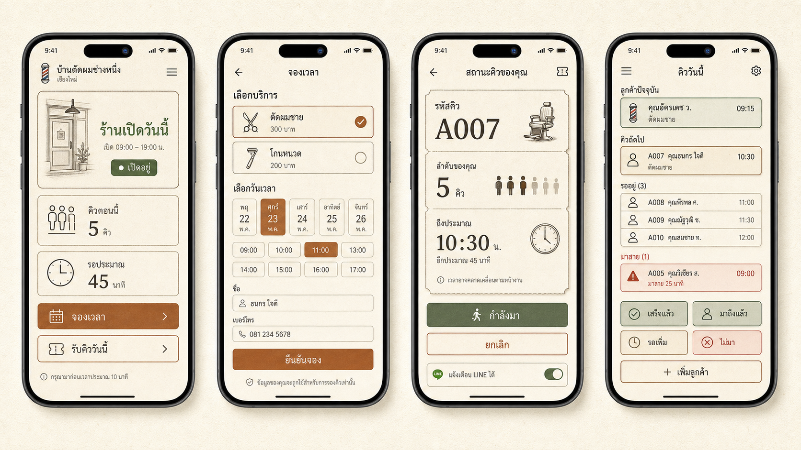
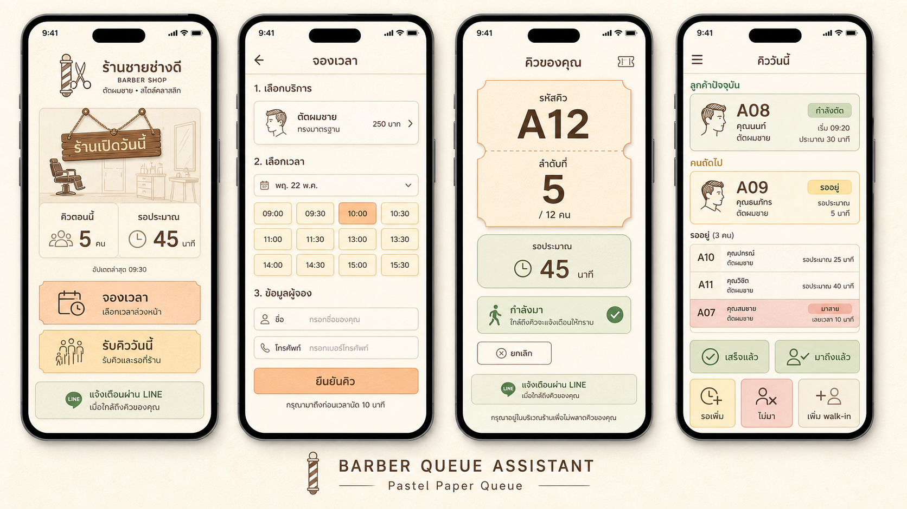

# Image-generation Results V1

## Warm Paper Queue board

Generated concept image:

Local file:

`docs/assets/concepts/warm-paper-flow-board.png`

Original Codex generated image:

`/Users/kiattisakmayong/.codex/generated_images/019f03f7-232c-72a3-9a5c-0fb6edb08987/ig_0a2ba92664728dd5016a3e74e019788191aca19aa98b188151.png`

## What works

- Warm paper/ticket direction fits a local one-owner barber shop.
- Customer side is clear: open status, current queue, wait estimate, booking, today's queue.
- Owner side is action-first: current customer, next queue, waiting list, late warning, large buttons.
- Copper, sage, and clay status colors are useful enough to become design-system tokens.
- Ticket/card borders create queue identity without feeling like a generic SaaS dashboard.

## Caveats

- Thai text in generated images can be imperfect; use the image as visual direction, not final copy.
- Some icon details are illustrative only; final implementation should use a consistent icon set or custom SVGs.
- The owner view needs careful responsive translation into real components so the queue rows stay readable on small phones.

## Design-system seeds

Use this concept as the likely base for:

- color tokens: paper, surface, ink, muted, copper, sage, clay, line;
- radius: moderate rounded rectangles, not pill-heavy;
- surface: flat paper cards with 1px warm borders;
- typography: Thai-first readable sans, strong numeric hierarchy for queue/time;
- components: status block, queue count block, time slot button, queue ticket, queue row, owner action button, late warning panel;
- admin pattern: large primary action + secondary action grid, no dense desktop dashboard by default.

## Pastel Paper Queue board

Generated after feedback that the first Warm Paper direction felt too hard/rigid.

Local file:

`docs/assets/concepts/pastel-paper-flow-board.png`

Original Codex generated image:

`/Users/kiattisakmayong/.codex/generated_images/019f0405-aa24-7861-8d1c-0b3d51a748f0/ig_0c03b6f710a0b89c016a3e788fb65081918ae1f36b383da28e.png`

## Pastel direction notes

This direction softens the earlier copper/charcoal system while keeping the queue-ticket identity.

Recommended design-system adjustment:

- Replace hard copper primary with peach/apricot.
- Use cocoa brown instead of near-black charcoal.
- Keep sage/mint for open, ready, and coming states.
- Use dusty rose for late/no-show instead of strong red.
- Keep warm cream paper background and subtle ticket borders.
- Avoid making the palette too candy-like; readability and owner action clarity still come first.
